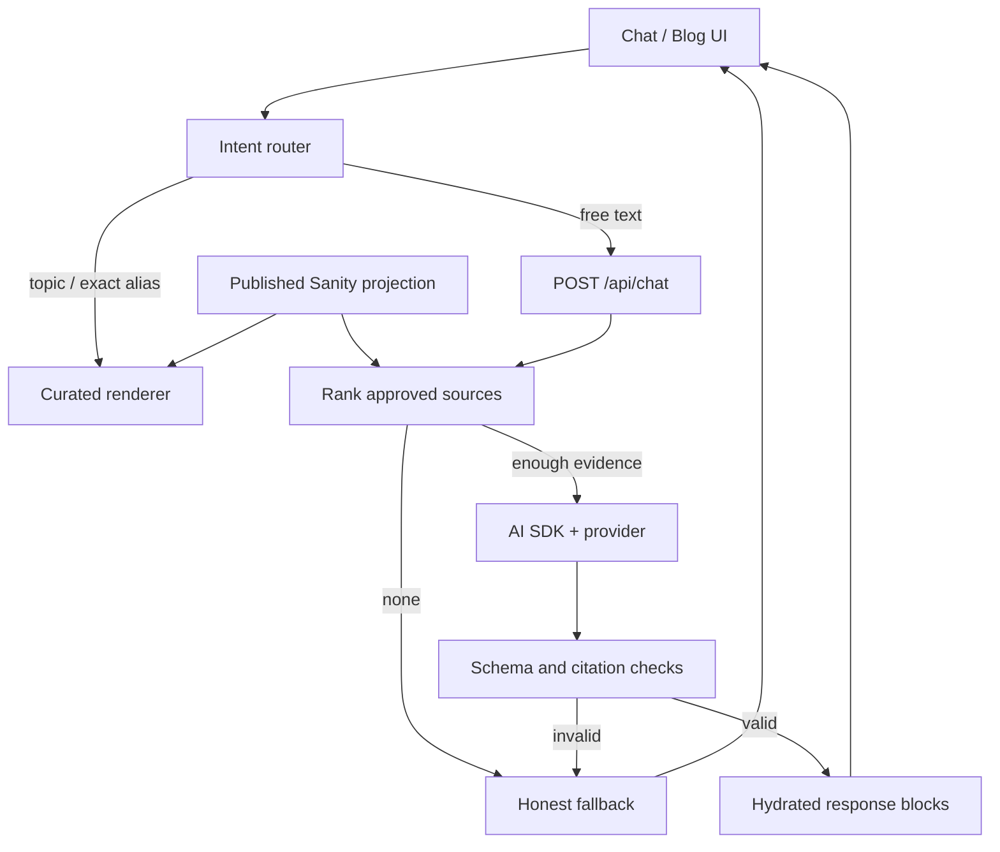

# Arsitektur IARCHI

Ibarat memesan makanan: tombol adalah menu, server menerima pesanan, Sanity menyimpan
daftar bahan, AI membantu menjelaskan bahan itu. Browser tidak diberi kunci gudang.

## Data flow

## Layout file target

Nama ini membatasi arah AI; file boleh dipecah bila alasan dicatat, bukan mengganti stack.

| Folder/file | Tanggung jawab |
|---|---|
| `frontend/app/layout.tsx` | server shell, metadata, theme init, Sanity live |
| `frontend/app/page.tsx` | server curated projection → client ChatShell |
| `frontend/app/blog/`, `work/`, `resume/` | server-rendered detail routes |
| `frontend/app/components/ui/` | GlassSurface, Button, SegmentedNav, Sheet |
| `frontend/app/components/chat/` | ChatShell, Thread, Composer, Suggestions, BlockRenderer |
| `frontend/app/components/portfolio/` | typed content cards, timeline |
| `frontend/lib/conversation/` | types.ts, router.ts, reducer.ts, persistence.ts |
| `frontend/lib/ai/` | server-only provider.ts, retrieval.ts, generate-answer.ts, rate-limit.ts |
| `frontend/lib/contracts/` | Zod response schemas; safe shared types |
| `frontend/sanity/lib/queries.ts` | static GROQ + explicit projections (typegen scans here) |
| `frontend/sanity/lib/public-content.ts` | published boundary; no draft context propagation to AI |
| `frontend/app/api/chat/route.ts` | validate request → budget/rate limit → orchestration |
| `studio/src/schemaTypes/` | DATA_MODEL documents/objects |
| `studio/src/structure/index.ts` | singleton handling and content menu |

No root Next app, no second package lock, no extra chat backend. Domain response
type tidak bergantung pada SDK UIMessage; adapter mengubah result ke block contract.
Server Components untuk konten/SEO, Client Components hanya untuk interaction/state.

## Ownership state

Satu reducer adalah sumber state thread curated maupun AI: turn ID, request ID, user
text, status, response blocks. Hook AI SDK mengelola transport pending request saja;
result selesai dipetakan ke turn ID yang sama. Dilarang menampilkan dua transcript
terpisah. Setelah restore, hasil hydrated ulang; model history menggunakan hanya
last 4 user questions plus validated context IDs, tidak mempercayai assistant output
yang dikirim browser.

Auto-scroll hanya ketika user dekat bottom (≤80px sebelum append); selain itu
tampilkan “New response” button. Next.js back tidak menghapus thread. Same topic
click ketika pending diabaikan; setelah selesai boleh bertanya kembali sebagai turn
baru. Event IME composition tidak dianggap submit.

## Data freshness dan boundaries

Curated page query tetap memakai live pipeline template; token scope dan preview
behavior diuji. AI public-content query pakai perspective published secara eksplisit,
`useCdn:false`, no-store untuk MVP agar unpublish tidak tertahan retrieval cache.
Max 200 source records, total normalized text 256KB; melewati batas → fail closed
dan rencanakan paginated retrieval, bukan silent truncate semua corpus.
Preview/editor source dilarang masuk AI walau browser sedang Draft Mode.

## Sanity generated types dan deployment

Kedua workspace punya predev yang bisa menulis `sanity.schema.json` bersamaan.
Initial workflow: generate Studio, frontend secara berurutan; jalankan server dengan
`npm exec --workspace=frontend -- next dev` dan `npm exec --workspace=studio -- sanity dev`.
T02 boleh merapikan script root untuk satu initial generation sebelum parallel dev.
Jangan menyalin schema ke dua lokasi atau menyunting types manual.

Vercel root `frontend` masih membutuhkan file root `sanity.schema.json`, root lock,
dan workspace install. Enable access outside Root Directory dan buktikan log build.
Environment di Sanity Studio adalah build-time public config; AI secret selalu frontend
server-only. Instruksi dashboard ada di DEPLOYMENT.
