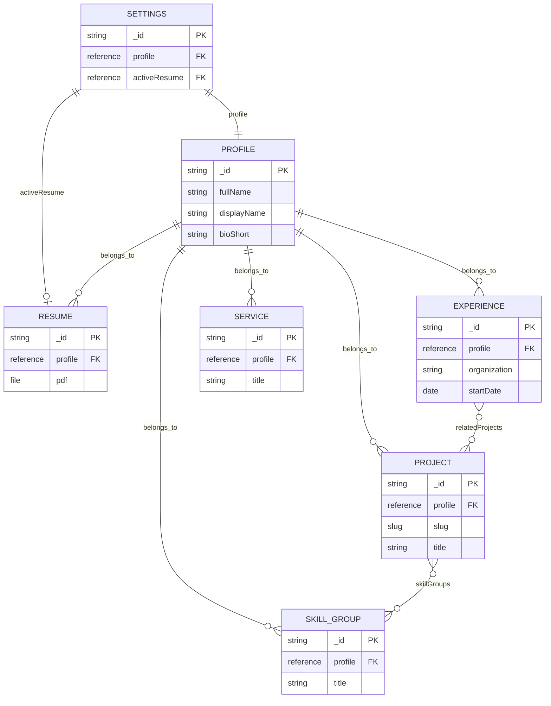
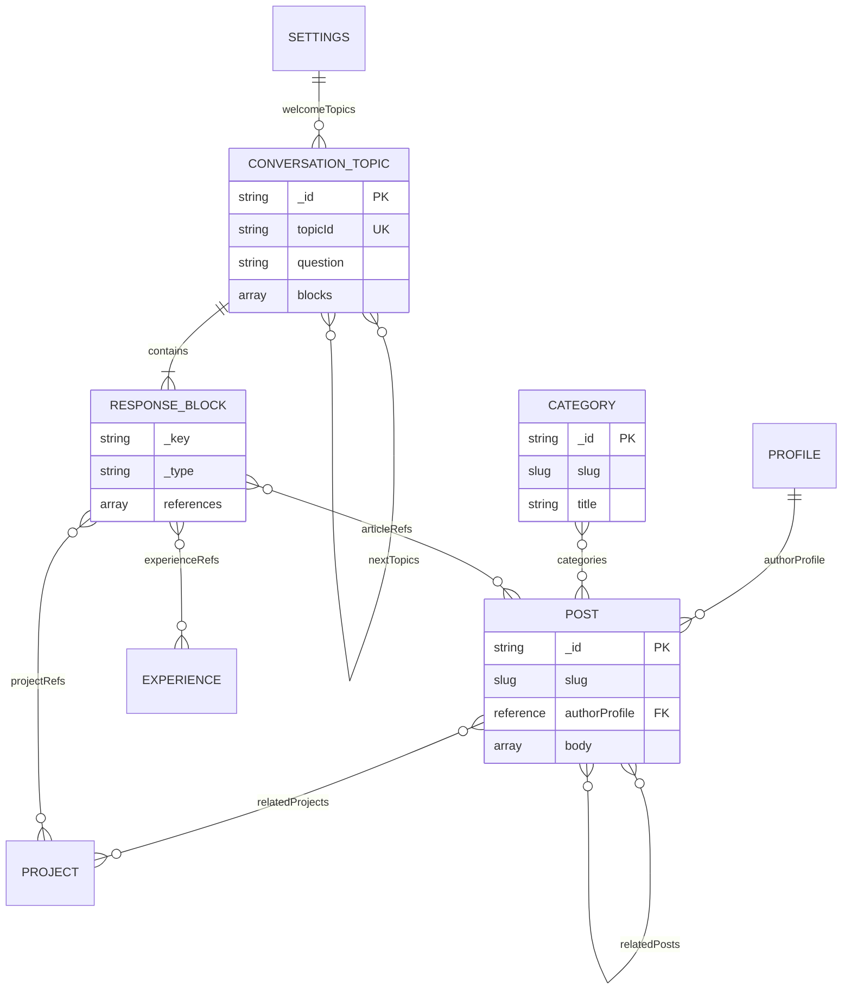

# Data model, ERD, dan kamus field

Versi 2 · nama dalam dokumen ini authoritative. Tidak ada SQL database untuk portfolio.
Sanity menyimpan JSON documents; reference seperti memilih kontak WhatsApp: cukup
simpan ID kontaknya, tidak menyalin seluruh biodata ke setiap chat.

## Cara membaca ERD

Kotak = document. `||` satu, `o|` nol atau satu, `o{` nol atau banyak, `|{` minimal satu.
Hubungan menunjukkan referensi logis; Sanity bukan SQL foreign-key engine. Aturan
cardinality dijaga schema validation, reference checking, dan public query.
Array references mempunyai `_key` untuk identitas elemen; document memakai `_id`.

### Identitas dan portfolio



### Editorial dan conversation



RESPONSE_BLOCK adalah embedded object, bukan koleksi/document terpisah. Referensi
lainnya: resume block→settings.activeResume; contact block→settings.contact;
skill block→skillGroup; timeline→experience; service block→service; image block→Sanity
image asset. Sanity image/file assets menggunakan asset references bawaan.

## Lifecycle dan naming

| Keputusan | Nilai |
|---|---|
| Settings singleton | `_type: settings`, `_id: siteSettings` |
| Profile singleton | `_type: profile`, `_id: profile.awwal` |
| Articles | `_type: post`, display label Blog post |
| Other document types | experience, project, skillGroup, service, resume, category, conversationTopic |
| Slugs | lowercase kebab-case; unik per type; max 80; reserved routes ditolak |
| Topic IDs | enum tetap dalam CONVERSATION_MAP, bukan label pertanyaan |
| Production content | owner-approved, verified, published, visibility public |

Semua document mempunyai `_id`, `_type`, `_rev`, `_createdAt`, `_updatedAt` bawaan.
`_rev` adalah revision ID, bukan tanggal verifikasi fakta. Field wajib ditandai `*`;
optional tidak berarti boleh diisi karangan. Enum UI disimpan sebagai string stabil.

### Common editorial fields

Berlaku pada profile, experience, project, skillGroup, service, post, resume,
conversationTopic. Category hanya title/slug/description; settings tidak butuh AI.

| Field | Type/default | Validation/semantik |
|---|---|---|
| `visibility*` | enum public/hidden; hidden | Filter distribusi website, bukan keamanan dataset |
| `reviewState*` | pending/verified; pending | Verified hanya setelah review owner |
| `lastVerifiedAt` | datetime | Wajib jika reviewState verified; tidak boleh future |
| `aiEligible*` | boolean false | Harus verified + public + aiSummary bila true |
| `aiSummary` | text ≤1200 chars | Fakta untuk retrieval; jangan copy dokumen rahasia |
| `keywords` | string[] ≤12 | lowercase trimmed, unik, max 40 chars/item |
| `featured` | boolean false | Urutan fitur tetap memakai array reference di settings |

Studio default pending/hidden; tombol publish perlu validasi cross-field. Seed script
hanya menciptakan drafts. Hanya data approved di CONTENT_INVENTORY boleh difinalkan
owner. `_id` published (tanpa `drafts.`) bukan jaminan reviewState verified.

## Kamus schema

### profile — satu identitas

| Field | Type | Validation/render |
|---|---|---|
| fullName* | string | 2–80 chars; Assabigunal Awwalun |
| displayName* | string | 2–30; Awwal |
| headline* | string | ≤100; satu positioning sentence |
| bioShort* | text | ≤320; hero/intro |
| bio | Portable Text | heading h2/h3, paragraph, list, inline link; no raw HTML |
| portrait | image+alt | alt wajib kecuali decorative flag; hotspot/crop |
| locationLabel | string | city/country approved, no street address |
| availability* | enum | undisclosed/open/selected/unavailable; default undisclosed |
| availabilityLabel | string | ≤60; visible hanya approved selain undisclosed |

### experience — satu riwayat per role

| Field | Type | Validation/render |
|---|---|---|
| profile* | reference profile | strong reference |
| organization*, role* | string | masing-masing 2–100 |
| employmentType | enum | internship/full-time/contract/freelance/other |
| startDate* | date | YYYY-MM-DD; UI format month/year |
| endDate | date | ≥startDate; wajib bila isCurrent false |
| isCurrent* | boolean false | true ⇒ endDate kosong; jangan infer dari endDate |
| summary* | text ≤400 | fokus kontribusi, no fake metrics |
| contributions | text[] ≤6 | ≤200 chars each |
| relatedProjects | reference[] project | unique; optional; display filtered |
| order* | integer ≥0 | sort priority kecil dulu, lalu startDate desc |

### project — evidence dan case study

| Field | Type | Validation/render |
|---|---|---|
| profile*, title*, slug* | ref/string/slug | title ≤80, uniqueness async |
| summary* | text ≤240 | preview card |
| status* | enum | concept/in-progress/released/archived; default concept |
| role* | string ≤100 | kontribusi owner, bukan klaim seluruh tim |
| problem*, approach* | Portable Text | minimal satu paragraph |
| outcome | Portable Text | optional; pending jangan tampilkan angka |
| cover | image+alt | optional; aspect 16:10; no random stock placeholder |
| gallery | imageWithCaption[] ≤8 | alt wajib, caption ≤160 |
| skillGroups | reference[] skillGroup | unique |
| links | linkObject[] ≤4 | label ≤32, https URL, type demo/repo/article |
| startedAt | date | optional; endedAt ≥ startedAt |
| endedAt | date | optional |
| order* | integer ≥0 | settings featured list menang untuk featured area |

### skillGroup dan service

skillGroup: `profile*` ref, `title*` string≤60, `items*` array 1–12 strings≤40,
`description`≤200, `order*` int. Tidak ada percentage skill bars atau rating rekaan.
service: `profile*`, `title*`≤80, `summary*`≤240, `deliverables*` 1–6 strings≤160,
`relatedProjects` ref[], `order*`. CTA selalu contact owner; tidak ada harga/checkout.

### post — extend tipe bawaan

| Field | Type | Validation/render |
|---|---|---|
| title*, slug* | string≤120/slug | slug unik, link legacy redirect |
| excerpt* | text≤240 | plain text |
| authorProfile* | reference profile | author legacy person dipertahankan selama transisi |
| publishedAt* | datetime | public query ≤now; scheduling bukan hanya publish button |
| updatedAtLabel | datetime | optional, ≥publishedAt |
| mainImage | image+alt | optional; gunakan key existing bila cocok |
| body* | Portable Text | h2/h3, paragraph, link, list, quote, code, image |
| categories | reference[] category | 0–3 unique |
| relatedPosts | reference[] post | 0–3, no self reference |
| relatedProjects | reference[] project | 0–3 |
| seo | object | title≤60, description≤160, image optional |

Reading time derived dari plain-text word count/200 dibulatkan ke atas; tidak disimpan
manual. Existing field names dicek T05; tambahkan mapping terdokumentasi bila starter
berbeda, jangan overwrite existing body/author.

category: `title*`≤50, `slug*` unik, `description`≤200. Initial values: Risk & controls,
Finance, Building, Notes. Vocabulary ini pilihan editorial, bukan empat menu utama.

### resume

`profile*` ref; `title*`≤80; `versionLabel*`≤30; `updatedAt*` datetime;
`pdf*` file accepted application/pdf; max 5MB; `language*` en/id;
`summary*`≤300. assets dipublish setelah owner menghapus nomor/alamat privat dari PDF
dan metadata. Website menggunakan activeResume reference tunggal di settings;
versi lama boleh tetap document tetapi tidak masuk route list. PDF URL publik hanya
untuk document aktif public+verified, tidak menjanjikan asset privat setelah unpublish.

### settings — singleton diperluas

`title*`≤60, `description*` existing compatible type, `profile*` ref, `activeResume`
optional ref, `welcomeTopics*` 3 unique refs conversationTopic, `featuredProjects`
0–3 refs, `contact` object {email?, socialLinks[]}, `seo` object, `defaultTheme*`
system/light/dark default system. `socialLinks` type github/linkedin/instagram/website;
HTTPS only. Email syntax validated; WhatsApp excluded until explicit owner request.
Canonical origin adalah env SITE_URL; jangan mempercayai request Host header.
Singleton structure menyembunyikan duplicate create; action validation menolak ID lain.

### conversationTopic

`topicId*` enum, `question*`≤100, `aliases` 0–12 strings≤80,
`blocks*` 1–8 embedded response block objects, `nextTopics` 0–3 unique refs,
`order*` integer. topicId immutable setelah digunakan browser state.

| `_type` embedded | Fields | UI block |
|---|---|---|
| answerText | text*≤1200 | text |
| projectSelection | projects* ref[] 1–3 | projects |
| experienceSelection | experiences* ref[] 1–6 | experience |
| skillSelection | groups* ref[] 1–6 | skills |
| articleSelection | posts ref[] 0–3; mode selected/latest | articles |
| serviceSelection | services ref[] 1–4 | services |
| resumeAction | no extra data | resume dari activeResume |
| contactAction | no extra data | contact dari settings |
| imageSelection | images* image[] 1–4 | gallery |

Topic empty after filtering → fallback text, bukan empty card. BlockRenderer ini
berbeda dari generic page builder BlockRenderer bawaan: gunakan namespace conversation.

## Query dan data integrity

Public filter: not draft/version + visibility public + reviewState verified; post
juga publishedAt≤now(). Public projection field-by-field, no spread `...`.
Query strings statis dengan `$slug`, `$ids`, `$now`; user tidak dapat mengirim GROQ.
AI tambah `aiEligible == true` dan non-empty aiSummary; fail closed pada null fields.
Periksa referenced target secara independen: parent public tidak membuat child public.
Hapus duplicate refs; urutan array dipertahankan. Jangan memakai model URL dari user.

Strong reference mencegah sebagian dangling delete, tetapi tidak menjamin target
published. Missing/unpublished ref di website disaring; Studio menunjukkan warning.
Sanity schema validation bukan security enforcement untuk API writer; setiap jalur
server tetap menerapkan filter tersebut. Lihat [datasets](https://www.sanity.io/docs/content-lake/datasets).

## Migrasi starter yang ditetapkan

| Existing | Aksi | Gate sebelum retire |
|---|---|---|
| settings / siteSettings | extend; jangan ganti _type/_id | preview resolver tetap benar |
| post | extend; route /blog | existing article dan /posts redirect diuji |
| person | retain hidden legacy editor group | author mapping person→profile reviewed; no delete otomatis |
| page | retain saat audit dataset | route conflict/reserved slugs diperiksa; no active page lost |
| link/blockContent objects | reuse/extend bila compatible | PortableText render + typegen |
| generated types/schema | regenerate sequential | diff menunjukkan intended changes |

Langkah aman: inventory document counts via Studio Vision → export dataset di luar
repo → tambah fields/schema secara additive → manual isi approved records → query
tests → resolver/route switch → baru retire legacy jika owner menyetujui. Export
archive tidak dimasukkan Git. Jangan menjalankan import sample data --replace.

## Contoh record belajar, bukan data produksi

```json
{
  "_id": "drafts.project.fineshyt",
  "_type": "project",
  "profile": {"_type": "reference", "_ref": "profile.awwal"},
  "title": "FINESHYT",
  "slug": {"_type": "slug", "current": "fineshyt"},
  "status": "concept",
  "summary": "A conversational personal-finance project.",
  "visibility": "hidden",
  "reviewState": "pending",
  "aiEligible": false,
  "order": 0
}
```

Contoh belum memenuhi semua required fields untuk publish—sengaja sebagai draft
yang memerlukan isi role/problem/approach owner. T05–T07 wajib menguji validation
dan missing-reference behavior, bukan menganggap contoh ini data final.
